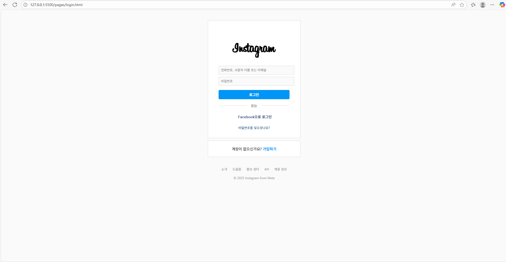
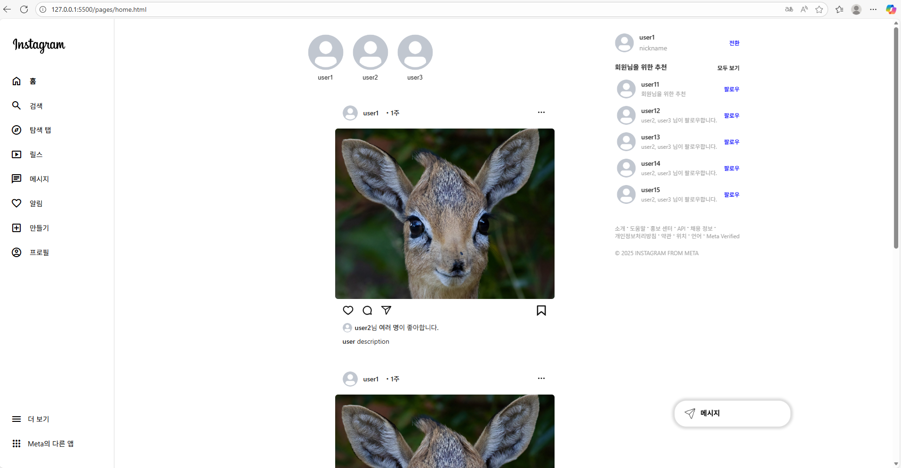
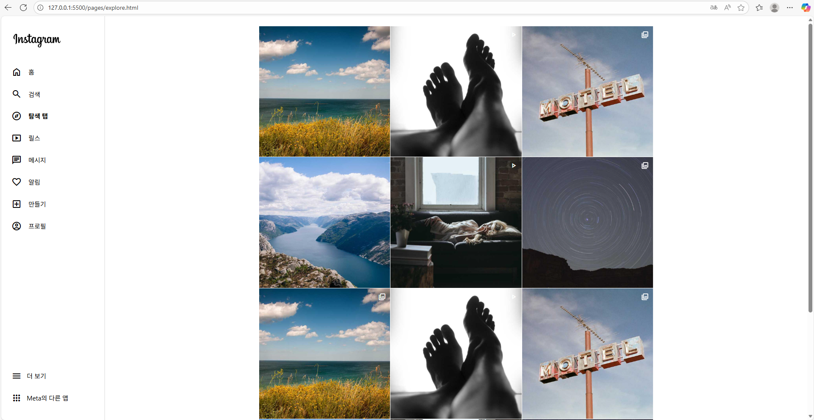
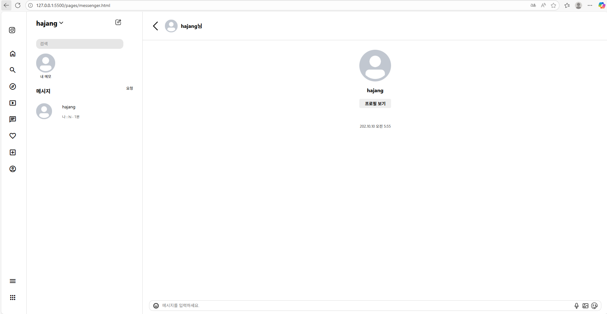
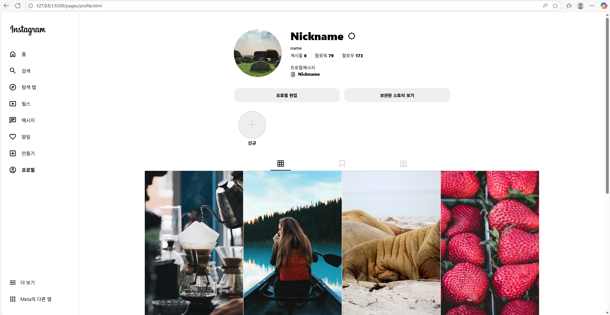

# 인스타그램 목업 페이지 작성

## 담당

* 코드 총괄 수정, 홈 화면 : 이민영

* 내비 사이드바, 프로필 화면 : 옥동은 (팀 구성 변경 전 작업분 작성)

* 메신저 화면 : 장한별

* 로그인 화면 : 오유진

* 탐색 화면, 검색 탭, 내비 사이드바 : 박윤주

## 각 화면 소개
### 로그인 화면

### 홈 화면

### 탐색 화면

### 메시지 화면

### 프로필 화면

## 기능 소개
1. 메인 첫 화면은 로그인 화면을 표시. 로그인 시, ID와 패스워드를 모두 입력하지 않고 로그인 버튼을 클릭하면 Alert 표시
-> 현재 로그인 폼을 처리할 서버가 없으므로, ID/패스워드는 임의로 아무거나 입력하기만 하면 됨

2. 로그인 후로는 메인 화면에서 자동으로 홈 화면으로 접속. 사이드바의 '더 보기'에서 로그아웃을 클릭하면 다시 로그인 화면을 표시.

3. 현재 접근 가능한 페이지는 홈 화면, 탐색 화면, 메신저 화면, 프로필 화면

4. 검색 탭은 검색 메뉴를 클릭하면 사이드바에서 표시. 이때 사이드바는 아이콘만 표시하는 방식.

5. 메신저 메뉴도 똑같이 화면에서 사이드바 아이콘만 표시.

6. 각 화면별 반응형 화면 적용 (PC, 태블릿)

## 개선 필요한 점
1. 일괄 적용할 코드 규칙을 만들 필요가 있음. 현재, 각 담당자마다 코드 스타일이 달라서 변수나 메소드 명명법이나 주 사용 문법이 판이하게 달라 가독성이 낮음.

2. Github 사용에 익숙해질 필요가 있음. 전 멤버의 Github 사용이 아직 원활하지 못하므로, 각 담당자마다 backup 폴더에 코드를 넣었으나, 향후에는 프로젝트별로 레포지토리를 만들고, main 이외의 브랜치에 담당자별로 브랜치를 별도 추가하는 방식으로 함. 메인 브랜치는 오로지 코드 리뷰 후 머지 및 배포용으로만 사용.

3. 스크립트 코드를 통일할 필요가 있음. 코드 규칙과 연관.

4. 연관된 페이지별로 스크립트와 css 스타일을 정리할 필요.

5. 모바일 화면에 맞춰서 구성하는 것은 실패했음. 기존의 코드들을 정리할 필요.
